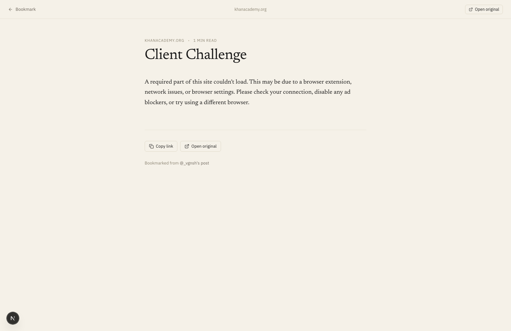
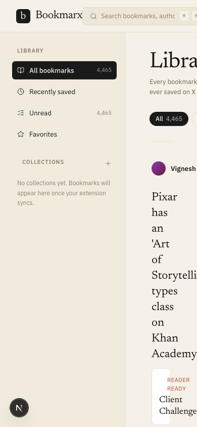

# Bookmarx

> Your X bookmarks, finally readable.


A local-first organizer, viewer, and reader for your X (Twitter) bookmarks.
Runs on your machine, against your own Postgres, with your own browser
session. Nothing in the cloud, no accounts, no telemetry, no SaaS.

- **Editorial reader** — serif body text, threads rendered as a connected
  sequence, no chrome.
- **Inline article reader** — Mozilla Readability extracts the article
  for any link in a bookmark, so you can read without leaving the app.
- **Collections** — color-coded, manually managed.
- **Filters** — unread, favorites, threads, media, links, long reads.
- **Browser extension** — pulls every bookmark you've ever saved
  (including the >800 the official API can't reach) using your own
  session cookies.
- **Local only by design** — your bookmarks live in your own Postgres.
  There's no hosted version, no auth, no remote endpoint.

## Screenshots

### Library (grid)


### Bookmark reader


### Article reader



### Mobile library



## Stack

- Next.js 16 (App Router) + React 19
- Tailwind CSS 4 (CSS-first `@theme` config)
- Drizzle ORM + Postgres (`postgres-js` driver)
- Zod for input validation
- Chrome MV3 extension for sync

## Quick start

You need Node 20+, pnpm, and a Postgres database running locally
(Postgres.app, Homebrew, or `docker run -p 5432:5432 -e POSTGRES_PASSWORD=postgres postgres:16`).

```bash
# 1. Install deps
pnpm install

# 2. Point at your local Postgres
cp .env.example .env
# edit .env and set DATABASE_URL

# 3. Push the schema to your database
pnpm db:push

# 4. (optional) Seed sample data so the UI has something to show
pnpm seed

# 5. Run the dev server
pnpm dev
```

Open <http://localhost:3000>. Then install the
[browser extension](./extension) and hit **Sync now** to pull your
bookmarks in.

## Why local-only?

Bookmarx isn't a service. It's a single-user app you run on your own
machine, against your own database, using your own X session. There
is no hosted version, no auth on the server, and no plan to add one —
the security model is "the server is bound to localhost." That's the
same reason the ingest endpoint has no token: nothing on the public
internet should ever talk to it.

If you want to read your bookmarks from another device on your LAN,
put a tunnel like Tailscale in front of `http://localhost:3000` —
that's outside the scope of this project but works fine.

## Project layout

```
src/
  app/
    page.tsx              Library
    b/[id]/page.tsx       Reader
    api/ingest/route.ts   POST endpoint for the extension
  components/
    library/              TopNav, Sidebar, FilterChips, BookmarkCard
    reader/               ReaderHeader, ReaderBody
  db/                     Drizzle schema + client
  lib/                    queries, format, ingest
extension/
  src/                    background, popup, xapi, transform
  manifest.json
scripts/
  seed.ts                 Sample data
```

## Development

```bash
pnpm dev          # next dev
pnpm lint         # eslint
pnpm db:studio    # drizzle studio
pnpm db:generate  # generate a migration after schema changes
pnpm db:push      # apply schema directly (dev only)
```

## License

MIT — see [LICENSE](./LICENSE).
