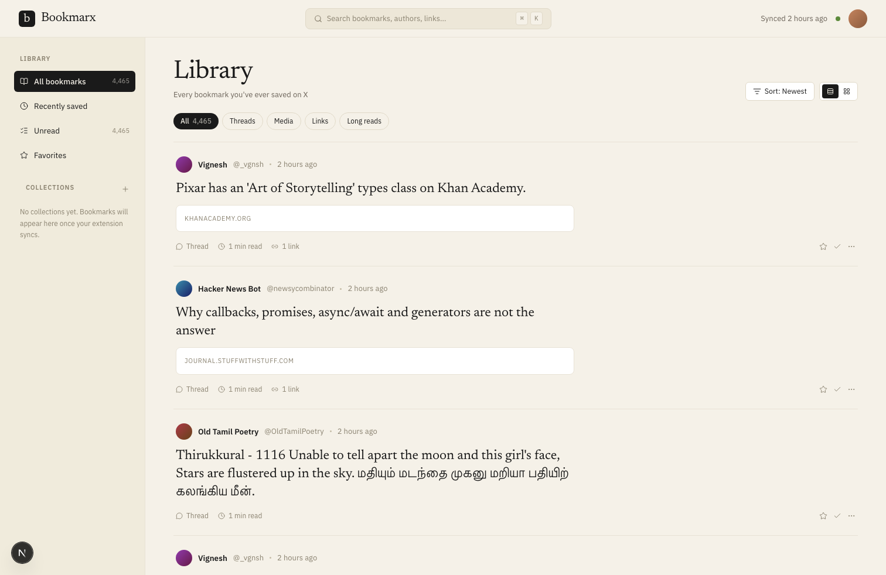
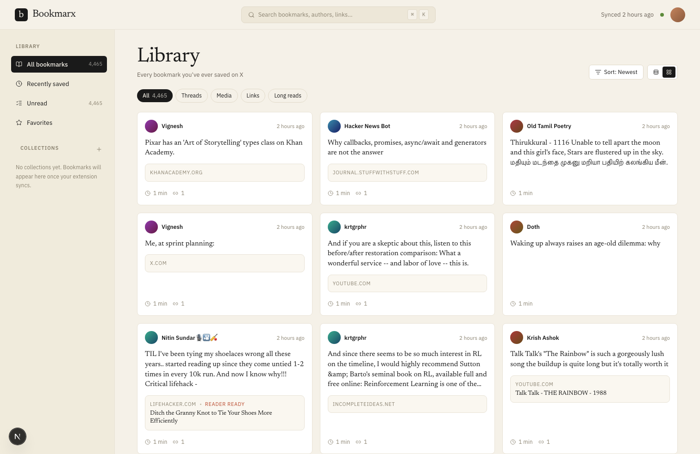
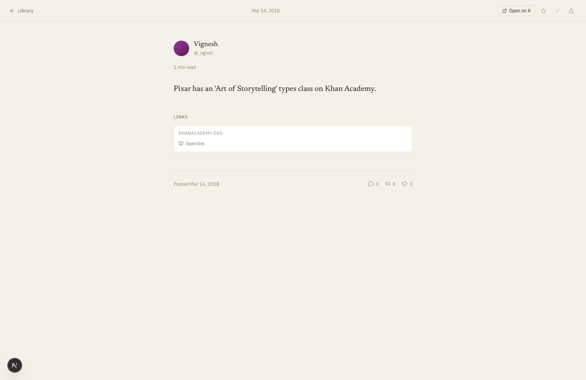

# Bookmarx

> Your X bookmarks, finally readable.



A local-first organizer, viewer, and reader for your X (Twitter) bookmarks.
Runs on your machine, against your own Postgres, with your own browser
session. Nothing in the cloud, no accounts, no telemetry, no SaaS.

- **Editorial reader** — serif body text, threads rendered as a connected
  sequence, no chrome.
- **Inline article reader** — Mozilla Readability extracts the article
  for any link in a bookmark, so you can read without leaving the app.
- **Collections** — color-coded, manually managed.
- **Filters** — unread, favorites, threads, media, links, long reads.
- **Browser extension** — pulls every bookmark you've ever saved
  (including the >800 the official API can't reach) using your own
  session cookies.
- **Local only by design** — your bookmarks live in your own Postgres.
  There's no hosted version, no auth, no remote endpoint.

## Screenshots

### Library (grid)



### Bookmark reader



### Article reader


## Stack

- Next.js 16 (App Router) + React 19
- Tailwind CSS 4 (CSS-first `@theme` config)
- Drizzle ORM + Postgres (`postgres-js` driver)
- Zod for input validation
- Chrome MV3 extension for sync

## Install

You need [Docker](https://docs.docker.com/get-docker/) (or OrbStack /
Colima / Podman) and a Chromium-based browser for the extension.

```bash
curl -O https://raw.githubusercontent.com/vignesh07/bookmarx/main/docker-compose.yml
docker compose up -d
```

That brings up Bookmarx + Postgres on `http://localhost:3000`. Migrations
run automatically on first start, and your bookmarks persist in a Docker
volume between restarts.

Then install the [browser extension](./extension) — load it unpacked
from a clone of this repo's `extension/` directory — open it, and hit
**Sync now** to pull your bookmarks in.

To stop:

```bash
docker compose down       # keep your data
docker compose down -v    # nuke everything including the database
```

To upgrade to a newer release:

```bash
docker compose pull && docker compose up -d
```

## Why local-only?

Bookmarx isn't a service. It's a single-user app you run on your own
machine, against your own database, using your own X session. There
is no hosted version, no auth on the server, and no plan to add one —
the security model is "the server is bound to localhost." That's the
same reason the ingest endpoint has no token: nothing on the public
internet should ever talk to it.

If you want to read your bookmarks from another device on your LAN,
put a tunnel like Tailscale in front of `http://localhost:3000` —
that's outside the scope of this project but works fine.

## Project layout

```
src/
  app/
    page.tsx              Library
    b/[id]/page.tsx       Reader
    api/ingest/route.ts   POST endpoint for the extension
  components/
    library/              TopNav, Sidebar, FilterChips, BookmarkCard
    reader/               ReaderHeader, ReaderBody
  db/                     Drizzle schema + client
  lib/                    queries, format, ingest
extension/
  src/                    background, popup, xapi, transform
  manifest.json
scripts/
  seed.ts                 Sample data
```

## Develop

If you want to hack on Bookmarx itself, skip Docker and run it directly.
You need Node 20+, pnpm, and a Postgres database (Postgres.app,
Homebrew, or `docker run -p 5432:5432 -e POSTGRES_PASSWORD=postgres postgres:16`).

```bash
pnpm install
cp .env.example .env       # set DATABASE_URL
pnpm db:push               # create the schema
pnpm seed                  # optional sample data
pnpm dev                   # next dev on :3000
```

Other useful scripts:

```bash
pnpm lint         # eslint
pnpm db:studio    # drizzle studio
pnpm db:generate  # generate a migration after schema changes
```

## License

MIT — see [LICENSE](./LICENSE).
